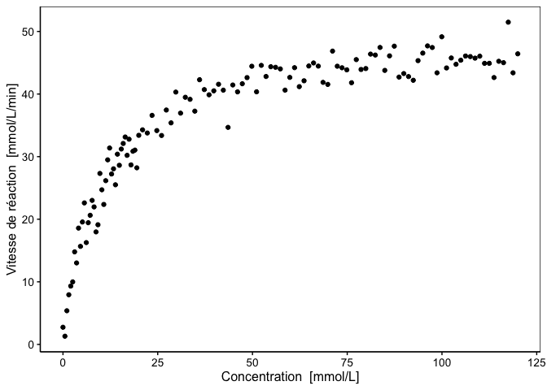

Vitesse d’une réaction chimique
================

<!--- do not edit readme.md ---->

## Avant-propos

Les consignes sont reprises dans ce document, ainsi que sous forme de
commentaires dans les différents fichiers. Elles sont susceptibles
d’évoluer. N’hésitez pas de vérifier le lien suivant afin de voir si des
modifications n’y ont pas été apportées :
<https://github.com/BioDataScience-Course/B04Ia_speed-reaction>

## Objectif

Ce projet est un projet *court*, *cadré*, *individuel* et qui doit être
**terminé pour la fin du module 4**. Il permet de montrer que vous êtes
capable d’utiliser la fonction `nls()` pour ajuster correctement un
modèle non linéaire dans un jeu de données. Ici, le modèle est connu/ :
il s’agit de l’équation de Michaelis-Menten.

Des scientifiques ont déterminé la vitesse initiale d’une réaction
chimique pour différentes concentrations en substrats (= réactifs). Le
jeu de données (`reaction.rds`) est mis à votre disposition dans le
dossier `data`.

``` r
speed <- read("data/reaction.rds")
```

Le graphique ci-dessous illustre les résultats obtenus. Les
scientifiques ont maintenant besoin de vous pour déterminer les
paramètres du modèle Michaelis-Menten pour cette réaction chimique.

``` r
chart(speed, speed ~ conc) +
  geom_point()
```

<!-- -->

Vous consignez vos résultats dans un document Rmd nommé
`speed_reaction.Rmd` dans le dossier `docs`. Votre document doit
compiler sans erreurs en une page HTLM lorsque vous “knittez” le fichier
Rmd (bouton **Knit** dans RStudio).
